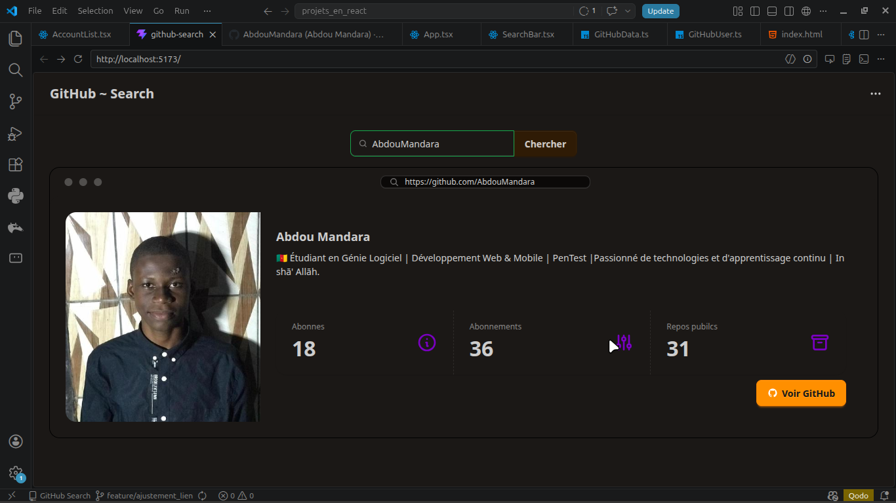

# GitHub Search

Une petite application React + TypeScript + Vite pour rechercher des utilisateurs GitHub et avoir leur infos.

## Description



Ce projet permet de :

- chercher des utilisateurs GitHub par login
- afficher une liste de résultats avec avatar et lien vers le profil
- naviguer entre les pages de résultats
- afficher les détails d'un utilisateur sélectionné
- utiliser l'API GitHub avec un token personnalisé via variable d'environnement

L'interface est construite avec Tailwind CSS et DaisyUI.

## Fonctionnalités

- barre de recherche avec validation
- pagination (`Page précédente` / `Page suivante`)
- liste des comptes GitHub retournés
- fiche détaillée d'un utilisateur sélectionné
- lien direct vers le profil GitHub officiel

## Installation

1. Ouvrir un terminal dans le dossier du projet :

```bash
cd 'GitHub Search'
```

2. Installer les dépendances :

```bash
npm install
```

3. Créer un fichier `.env` à la racine du projet :

```env
VITE_GITHUB_TOKEN=your_github_personal_access_token
```

> Le fichier `.env` est déjà ignoré par Git (`.gitignore`). Ne partage pas ton token.

## Exécution

```bash
npm run dev
```

Puis ouvrir l'URL fournie par Vite dans le navigateur.

## Scripts disponibles

- `npm run dev` : démarrer le serveur de développement
- `npm run build` : compiler le projet
- `npm run preview` : prévisualiser la version buildée
- `npm run lint` : lancer ESLint

## Structure principale

- `src/App.tsx` : composant principal
- `src/api/GitHubData.ts` : logique d'appel à l'API GitHub
- `src/components/` : composants UI
- `src/types/GitHubUser.ts` : type TypeScript des données utilisateur

## Remarques

- Sans token ou en cas de limite d'API, les requêtes GitHub peuvent être bloquées.
- Utilise un token GitHub personnel pour améliorer la fiabilité des requêtes.
- Le projet s'appuie sur `import.meta.env.VITE_GITHUB_TOKEN` pour le token.

Fait par [AbdouMandara](https://github.com/AbdouMandara)